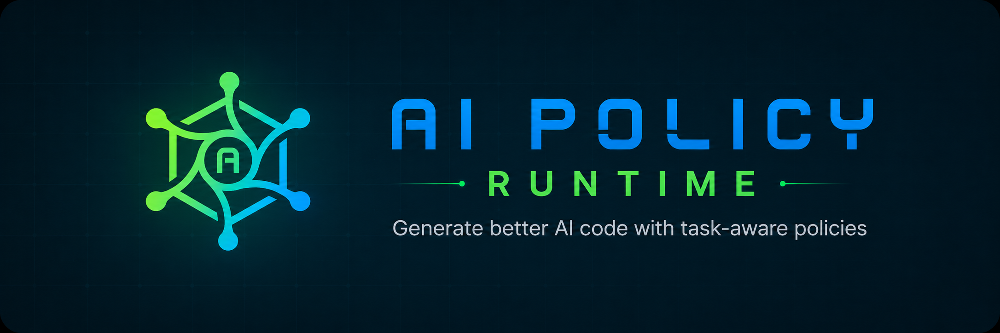

AI Policy Runtime helps AI coding agents generate higher-quality code by giving
each task the right engineering policies before code is written. It resolves the
developer request into task context, activates relevant Skill packs, produces
Effective Rules, and injects those rules into tools such as Codex, Claude Code,
or a custom agent workflow.

## Why It Exists

AI coding agents work better when the rules are specific to the task instead of
stored as one large static instruction file. A C++20 low-latency API design task
needs different constraints than a general refactor, a review, or a frontend
change.

This runtime makes those rules explicit, reproducible, and inspectable:

- resolve the current task into structured context
- activate the matching Skills and policy packs
- reduce them into task-scoped Effective Rules
- inject the result into an agent-facing prompt or project instruction file
- optionally verify generated output against deterministic rules

## Install

```powershell
pip install -e .
```

For optional transformer-based semantic recall:

```powershell
pip install -e ".[semantic]"
```

The default runtime does not call an LLM and does not download models. It uses
deterministic analysis first, then the best configured semantic matcher when
available.

## Quick Start

Resolve a task into agent-facing Effective Rules:

```powershell
python -m ai_policy_runtime.cli resolve `
  --pack cpp.production_refinement `
  "Refactor this C++20 code so it is not just working. Reduce complexity and preserve safety."
```

Example output:

```text
# Effective Rules for Current Task

## Task Context

- Language: C++
- Standard: C++20
- Selected Standard Is Known: true
- Refinement Requested: true
- Artifact Type: code
- Behavior Preservation Required: true
- Cpp Template Abstraction Candidate: true
- Template Constraints Required: true
- Source Structure: true
- Type Sensitive: true
- Domain: cpp
- Task Type: refactor_code
- Capabilities: refactor_code
- Tags: code-quality, complexity, cpp, cpp20, refactoring, review, safety, standard-library, templates

## HARD Rules

- Preserve the existing observable behavior while reducing complexity unless the task explicitly asks for a behavior change.
- Avoid undefined behavior.
- Do not use facilities unavailable in the selected C++ standard.
- Avoid invalid or unsafe casts that bypass type and lifetime safety.
- Preserve ownership and lifetime safety.
- Do not introduce resource leaks.
- Do not use unchecked bounds access unless the valid range is proven by a clear invariant.

## SOFT Rules

- Remove accidental complexity that does not contribute to correctness, extensibility, performance, or clarity.
- Avoid extracting code only because it looks similar when the duplicated fragments represent different responsibilities or are likely to change independently.
- Avoid introducing abstractions that increase conceptual overhead without improving reuse, clarity, testability, or extension.
- Make each component feel complete by clarifying its public contract, expected inputs, outputs, failure behavior, and ownership of important state.
- Handle important boundary conditions and failure paths explicitly rather than leaving them as implicit assumptions.
- Keep complexity that represents real domain rules, safety constraints, performance needs, or important extension points.
- Use language-native constructs that express the operation directly when they preserve clarity, correctness, and maintainability.
- Keep dependency direction stable and avoid designs where low-level components unexpectedly depend on high-level orchestration details.
- Group related state, helper functions, and behavior into coherent components with clear responsibilities, names, interfaces, and placement.
- Avoid creating broad utility or manager components that collect unrelated responsibilities under a vague name.
- Avoid replacing clear specialized logic with a parameterized abstraction whose many flags or modes make behavior harder to understand.
- Keep headers self-contained so they can be included independently.

## Preferences

- Prefer safety over performance.
- Prefer standard vocabulary type over ad hoc convention.
- Prefer effective complexity over accidental complexity.
- Prefer clear call chain over hidden cross layer coupling.
- Prefer cohesive component over scattered helper logic.
- Prefer clarity over cleverness.

## Verification Requirements

- Verify behavior preservation.
- Verify no new ownership, lifetime, resource, bounds, or undefined-behavior risks were introduced.
- Verify recommendations use facilities available in the selected C++ standard.
- Verify the refactoring reduced accidental complexity without introducing over-abstraction.
```

Explain the detected task context:

```powershell
python -m ai_policy_runtime.cli explain `
  "Refactor this C++20 code so it is not just working. Reduce complexity and preserve safety."
```

Validate Skills and packs:

```powershell
python -m ai_policy_runtime.cli validate
```

Run the bundled example:

```powershell
python examples/cpp_low_latency.py
```

Run tests:

```powershell
python -m unittest discover -s tests
```

## Use With Agents

Inject Effective Rules into a generated prompt, Codex instructions, or Claude
instructions:

```powershell
python -m ai_policy_runtime.cli inject --target custom
python -m ai_policy_runtime.cli inject --target codex
python -m ai_policy_runtime.cli inject --target claude
```

Run Codex through the policy wrapper:

```powershell
policy-codex `
  --pack cpp.production_refinement `
  "Refactor this C++20 code so it is not just working. Reduce complexity and preserve safety."
```

Add a second, behavior-preserving refinement pass after the first successful
agent run:

```powershell
policy-codex `
  --pack cpp.low_latency `
  --post-refine `
  --verify-target src `
  "Implement a C++20 matching-engine API."
```

Run Claude Code through the policy wrapper:

```powershell
policy-claude `
  --pack cpp.production_refinement `
  "Refactor this C++20 code so it is not just working. Reduce complexity and preserve safety."
```

Use this repository as a Codex plugin to resolve each submitted prompt through
the runtime hook. The plugin files live in:

```text
.codex-plugin/plugin.json
hooks/hooks.json
hooks/user_prompt_submit.py
```

A VS Code extension is also included in `vscode-extension/`. It writes
workspace configuration to `.policy/config.json` so the Codex hook can enable
or disable packs without hand-editing environment variables.

## Programmatic Use

```python
from ai_policy_runtime import PolicyRuntime, RuntimeConfig

runtime = PolicyRuntime(RuntimeConfig.from_values(root="."))
result = runtime.resolve(
    "Refactor this C++20 code so it is not just working. "
    "Reduce complexity and preserve safety.",
    ("cpp.production_refinement",),
)
```

To apply this policy repository to another project, keep the target project root
separate from the policy asset root:

```python
runtime = PolicyRuntime(
    RuntimeConfig.from_values(
        root=r"D:\work\target-project",
        policy_root=r"D:\MilesLi\ai-policy-runtime",
    )
)
result = runtime.resolve(
    "Refactor this C++20 code so it is not just working. "
    "Reduce complexity and preserve safety.",
    ("cpp.production_refinement",),
)
```

In this mode, the target project receives `.policy/current/`, `AGENTS.md`, or
`CLAUDE.md`, while Skills and packs are loaded from `policy_root`.

## Outputs

`resolve` writes the current task state to `.policy/current/`:

```text
task-context.json
effective-rules.json
effective-rules.yaml
effective-prompt.md
trace.json
```

Verification writes:

```text
.policy/current/violations.json
```

Run verification against generated output:

```powershell
python -m ai_policy_runtime.cli verify --target path\to\output.cpp
```

## Repository Map

```text
ai_policy_runtime/
  domain/          TaskContext, Skill, Rule, SkillPack, diagnostics, config
  infrastructure/  YAML/JSON loading, condition evaluation, schema loading
  services/        registry, engine, validation, rendering, verification
  application/     PolicyRuntime orchestration
  interfaces/      CLI and agent adapters
  task_analysis/   exact analysis, project scanning, semantic recall
skills/            Skill DSL files
packs/             reusable policy packs
schemas/           JSON Schemas for Skills, packs, and Effective Rules
hooks/             Codex plugin hook
vscode-extension/  VS Code configuration surface
docs/              design and usage documentation
```

## Documentation

- [Usage Guide](docs/usage.md): CLI commands, wrappers, plugin setup, VS Code,
  embeddings, cache, and verification details.
- [Skill Policy Runtime](docs/skill_policy_runtime.md): runtime model and core
  concepts.
- [Automation Strategy](docs/policy_runtime_automation_strategy.md): agent
  integration lifecycle and injection strategy.
- [Post-Task Refinement Workflow](docs/post_task_refinement_workflow.md):
  wrapper-level automation for behavior-preserving production refinement.
- [Skill DSL Syntax](docs/skill_dsl_syntax_specification.md): Skill file format.
- [Effective Rules Output](docs/effective_rules_output_specification.md):
  generated rule output contract.
- [C++ Skill Library Design](docs/cpp_skill_library_design.md): current C++
  policy library structure.

## Notes

- JSON skill files work with the Python standard library.
- YAML skill files are supported through `PyYAML`.
- The runtime produces Effective Rules for AI agents; it is not itself an LLM.
